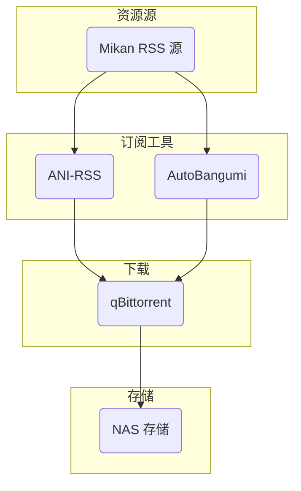

## 目录
- [目录](#目录)
- [引言](#引言)
- [原理介绍](#原理介绍)
- [qbittorrent](#qbittorrent)
  - [安装](#安装)
  - [使用](#使用)
- [订阅](#订阅)
  - [ANI-RSS](#ani-rss)
    - [安装](#安装-1)
  - [AutoBangumi](#autobangumi)
    - [安装](#安装-2)
    - [设置](#设置)
- [总结](#总结)
## 引言
现在市面上尚存的自动追番流程教学要么[古老落灰](https://blog.17lai.site/posts/9912bd5d/), 要么并不完善, 因此我决定写一篇关于自动追番的教程, 以便于后续的使用和维护. 本文将介绍如何使用`qbittorrent`、`ANI-RSS`和`AutoBangumi`来实现自动追番.
## 原理介绍

RSS(Really Simple Syndication)是一个非常古老的协议, 其原理是通过一个XML文件来描述一系列的链接, 例如视频、音频、图片等. 这个XML文件可以被任何支持RSS的客户端解析, 例如RSS阅读器、浏览器等. 通过RSS, 我们可以很方便地获取到最新的资源.

Mikan是一个非常优秀的追番网站, 其提供了一个RSS接口, 通过这个接口, 我们可以获取到最新的番剧资源. 但是, Mikan的RSS接口并不支持自动下载, 因此我们需要使用一些工具来实现自动下载.

本文将介绍两种自动追番工具用于订阅 Mikan, `ANI-RSS` 和`AutoBangumi`. 个人推荐`ANI-RSS`, 有更强大的功能, 更好的可视化和体验.

最后, 我们使用`qbittorrent`作为下载工具.

## qbittorrent
qbittorrent是一个开源的BitTorrent客户端, 它支持多种操作系统, 包括Windows、Linux和macOS. 我们将在Docker中运行它.

> 什么是Torrent?
> Torrent是一种点对点的文件共享协议, 它允许用户在互联网上共享和下载文件. Torrent文件包含了文件的元数据和分布式哈希表, 使得用户之间可以相互分享文件, 也就是P2P协议.
> 而现在几乎所有的字幕组都使用Torrent来发布资源.

### 安装

- 创建`docker-compose.yml`文件
- 创建`config`文件夹
- 选择一个下载位置, 这个下载位置里会存放你的番剧, 如配置中的`~/NAS/media/jellyfin`, 你可以选择任何一个文件夹, 只要你有权限访问即可.
```yaml
# docker-compose.yml (需要修改)
version: '3.8'
---
services:
  qbittorrent:
    image: lscr.io/linuxserver/qbittorrent:latest
    container_name: qbittorrent
    environment:
      - PUID=1000
      - PGID=1000
      - TZ=Etc/UTC
      - WEBUI_PORT=8080
      - TORRENTING_PORT=64284
    volumes:
      - ./config:/config
      - ~/NAS/media/jellyfin:/downloads #optional
    network_mode: host
    # ports:
    #   - 8080:8080
    #   - 64284:64284
    #   - 64284:64284/udp
    restart: unless-stopped
```
随后使用
```bash
docker-compose up -d
```
启动`qbittorrent`, 访问`http://localhost:8080`即可访问`qbittorrent`的WebUI, 默认用户名和密码均为`adminadmin`.
> 注意: 如果你使用的是Docker Desktop, 你需要将`network_mode`改为`bridge`, 并将端口映射到宿主机上. 例如:
```yaml
    ports:
      - 8080:8080
      - 64284:64284
      - 64284:64284/udp
```
### 使用
你可以参照这个[qbittorrent的教程](https://blog.17lai.site/posts/f6b32521/#%E8%A1%8C%E4%B8%BA%E5%8F%82%E6%95%B0)尝试配置, 然而, 默认配置也可以使用, 只需要自行修改密码即可.

## 订阅
### ANI-RSS
[ANI-RSS(ASS)](https://github.com/wushuo894/ani-rss) 如前文介绍. 
#### 安装
- 新建`config`文件夹
- 新建`docker-compose.yaml`
注意修改你的下载目录
```yaml
#docker-compose.yaml (需要修改)
version: "3"
services:
  ani-rss:
    container_name: ani-rss
    volumes:
      - ./config:/config
      - ~/NAS/media/jellyfin:/Media
    ports:
      - 7789:7789
    environment:
      - PORT=7789
      - CONFIG=/config
      - TZ=Asia/Shanghai
    extra_hosts:
      - 'host.docker.internal:host-gateway'
    restart: always
```
基础的设置可参阅[ASS的官方文档][ASS文档]
对于我们在`docker`运行`qbittorrent`的情况, 将地址设置为`http://host.docker.internal:8080`


### AutoBangumi
虽然`AutoBangumi(AB)`被更多人使用, 但是很遗憾, 这已经是一个过时的软件了.
#### 安装
- 创建`docker-compose.yaml`
- 创建`config`文件夹
- 创建`data`文件夹
```yaml
# docker-compose.yaml (无须更改)
version: "3.8"

services:
  AutoBangumi:
    image: "ghcr.io/estrellaxd/auto_bangumi:latest"
    container_name: AutoBangumi
    volumes:
      - ./config:/app/config
      - ./data:/app/data
    ports:
      - "7892:7892"
    network_mode: bridge
    restart: unless-stopped
    environment:
      - TZ=Asia/Shanghai
      - PGID=1000
      - PUID=1000
      - UMASK=022
    extra_hosts:
    - 'host.docker.internal:host-gateway'
```
#### 设置
可参阅其[官方文档][AB文档].
对qbittorrent地址的设置同理

## 总结
至此, 你应该参阅订阅工具的文档成功下载番剧了, 当你关注的字幕组更新后, 你的订阅工具就会自动使用qbittorrent把番剧下载到硬盘里, 哦对了, 赞美字幕组!

我会在下一篇文章中介绍如何在使用优雅的观看硬盘中的视频.


[ASS文档]: https://docs.wushuo.top/add-rss
[AB文档]: https://www.autobangumi.org/changelog/3.1.html